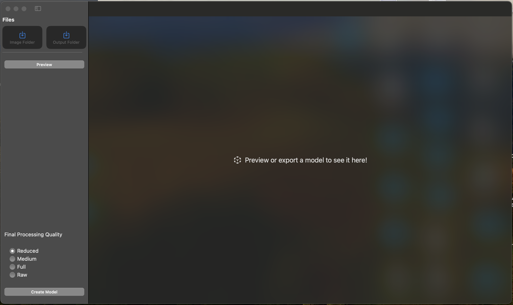
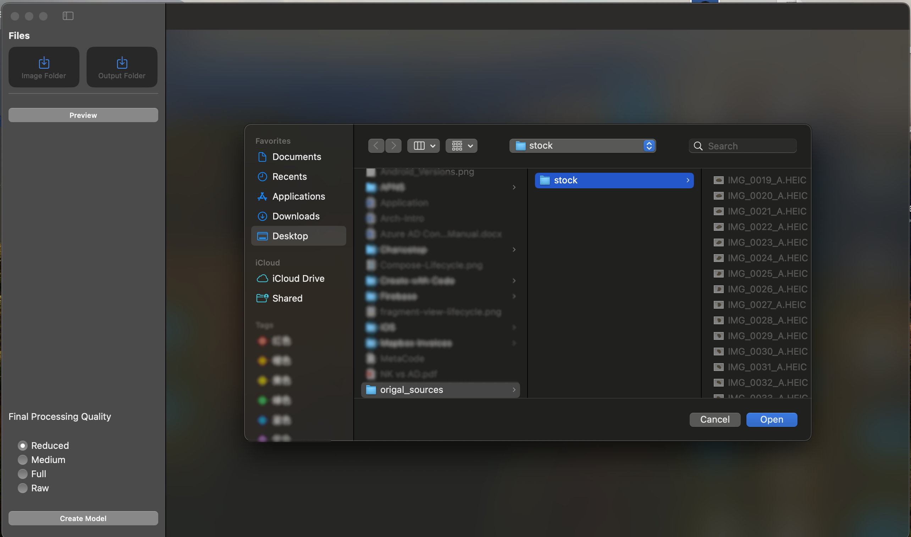
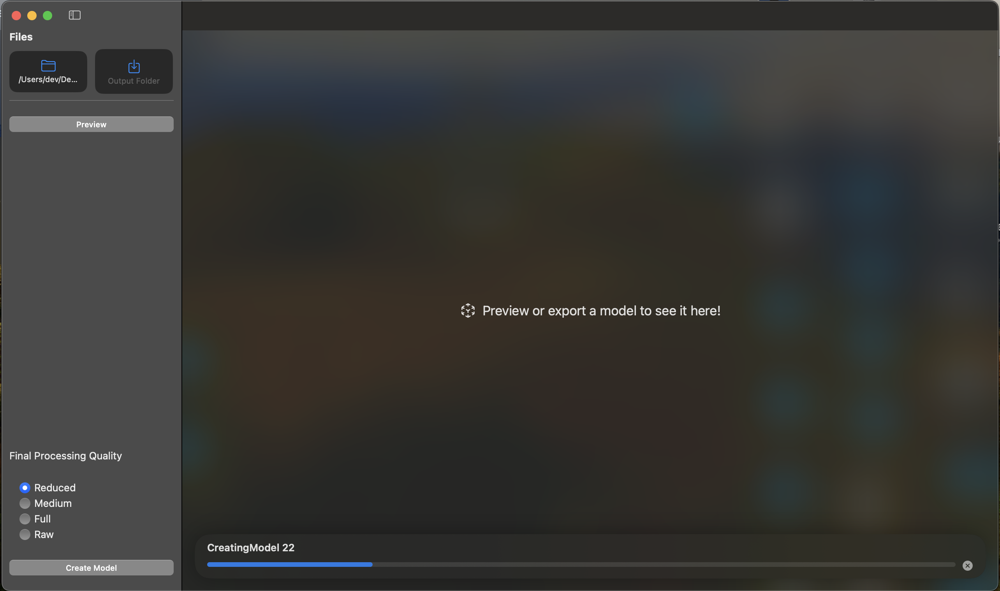
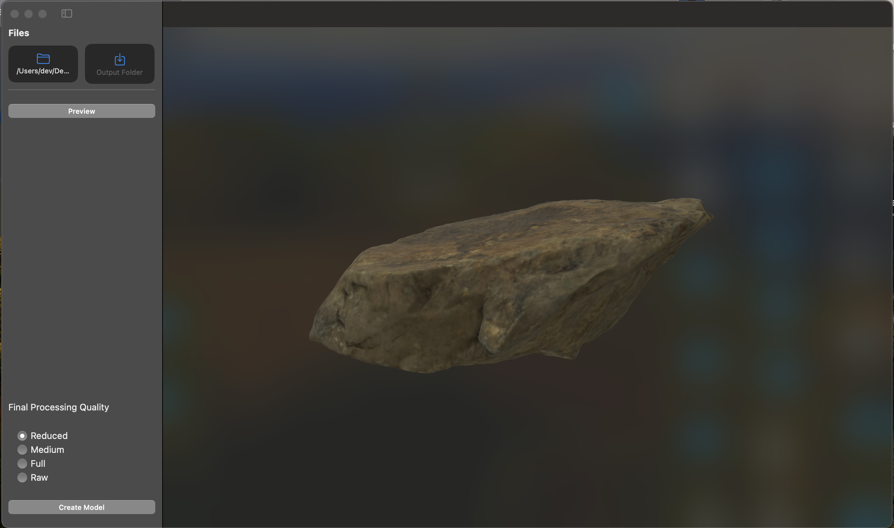
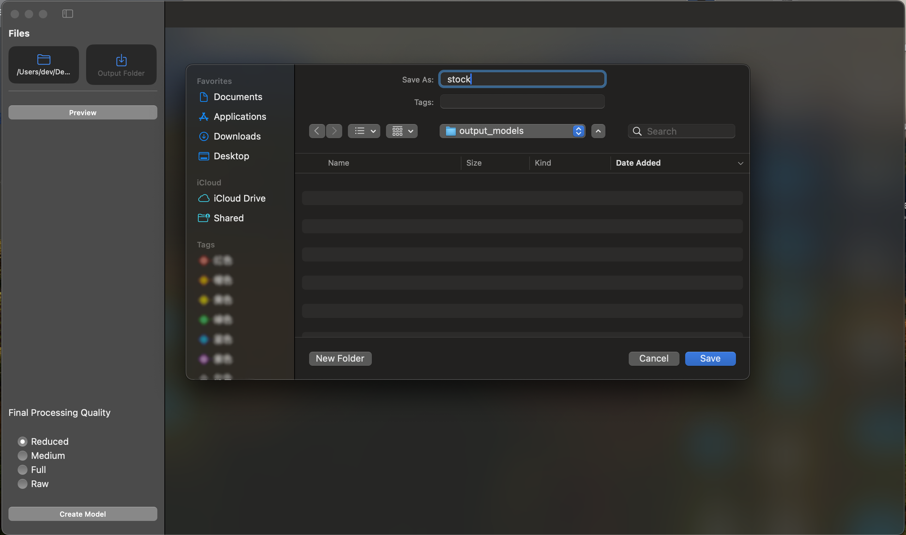
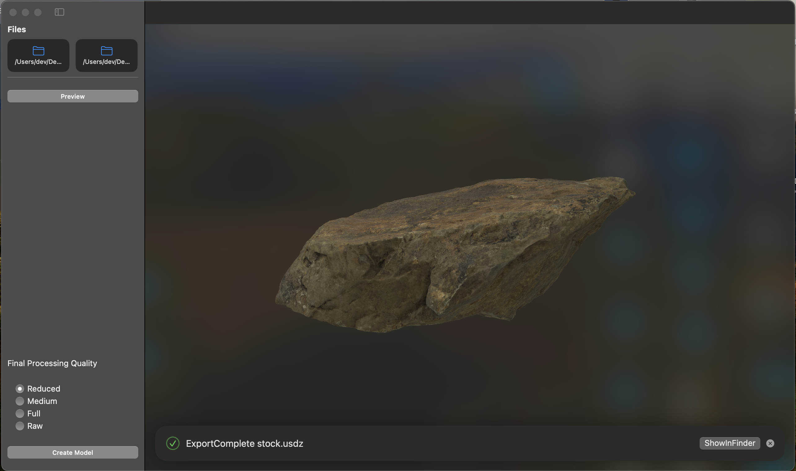
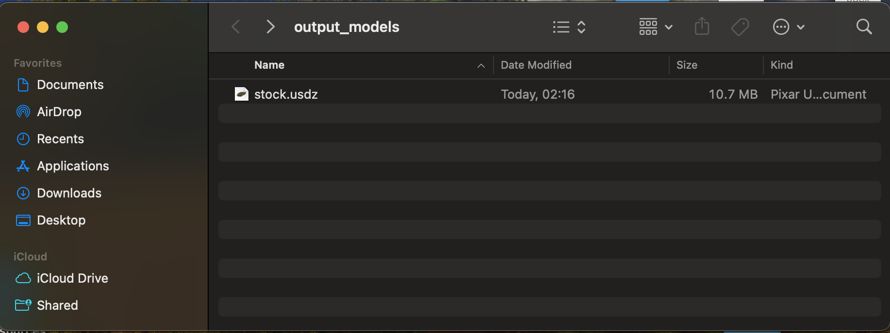

# Object Capture

## Table of Contents
- [Project Overview](#project-overview)
- [Development Environment Setup](#development-environment-setup)
- [Key Technical Points](#key-technical-points)
- [Challenges and Solutions](#challenges-and-solutions)
- [Useful Resources and Tools](#useful-resources-and-tools)
- [Learning Reflections](#learning-reflections)

## Project Overview
After watching the official introduction [video](https://developer.apple.com/videos/play/wwdc2021/10076) of WWDC 2021, we decided to develop a desktop application. It utilizes Object Capture to generate 3D models, thus allowing us to model. That desktop app shown in the video we didn't find in the App Store or Apple's official website (Apple only provides a command line tool). Eventually, our team decided to implement it. This was even though most of us had no prior experience with MacOS App development. We enjoyed the learning and thinking process and it will be our first step to explore VR,AR development!

## Learning Objectives
- Learn to write macOS applications using Swift
- Learn more about how to [create 3d objects from photographs](https://developer.apple.com/documentation/RealityKit/creating-3d-objects-from-photographs)
- Master the [PhotogrammetrySession](https://developer.apple.com/documentation/realitykit/photogrammetrysession)
- Understand the implementation of concurrent programming

## Development Environment Setup
- **Operating System**: macOS Sonama 14.0 or above
- **Development Tool**: Xcode 15.0.0 or above
- **Dependency Management Tool**: Swift Package Manager

## Use Guideline
- Open the Object Capture App, you will see the pic below.

- Click the” Image Folder“ button and select the folder where your images(material) sit, as show below.

- If you want to preview the model in full, please click the "Preview" button
  - Generate the preview model

  - Preview the rendering

- Click the "Output Folder" and select the final output folder for model files(.usdz) and name the files

- Create the final 3D model

## Challenges and Solutions
The team was not experienced enough in SwiftUI development, so we encountered a variety of problems during the development process, I hereby record some of the problems we encountered during the development as well as my thoughts so that developers can have a quick reference to solve the same problems we encountered!

Our team also encountered some problems during the development of this desktop application, as well as confusion and thoughts about the use of SwiftUI, please refer to [Dev Notes](DevelopmentNotes.md).
